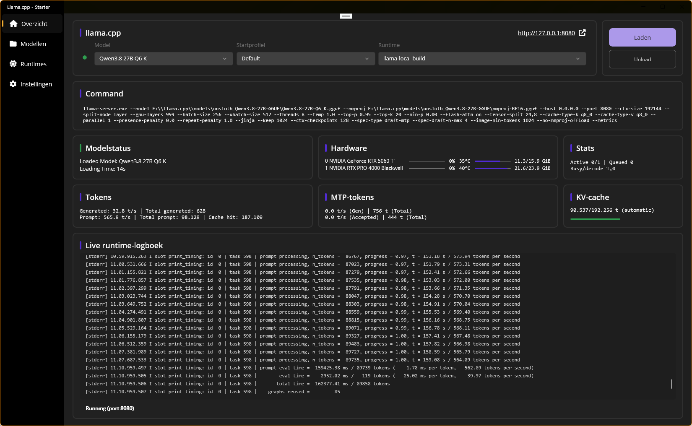

# llama-cpp-starter



A .NET MAUI desktop app (Windows) that launches `llama-server.exe` with per-model launch profiles.

## What the app does

- **Runtimes** — pick a folder with local llama.cpp builds; the app scans it recursively for `llama-server.exe`, detects the backend (Cuda/Vulkan/Rocm/Metal/CPU) and stores the runtimes in a local SQLite database.
- **Models** — scan a models folder for GGUF files (PascalCase name, quantization from the file name or GGUF metadata, size; `*mmproj*.gguf` is auto-linked; projector/draft/MTP companion files are kept out of the model list). Each model gets GGUF metadata (JSON blob in the DB) and, on selection, a capability summary (architecture, context length, chat template, vision, MoE, …) — cached as a JSON blob on the model and re-read as soon as the file changes. Models are single-selectable; below the selected model sit its **launch profiles**. Per model you manage launch profiles: all `llama-server` start parameters in one editor panel with a live command preview (incl. auto-resolution of `--spec-draft-model`, embedded MTP included). Profiles are stored as JSON blobs; each new model gets a `Default` profile seeded from the app-global defaults (cannot be renamed or removed).
- **Overview** — pick model + launch profile + runtime and click **Load** to start the server (live log + health polling on `/health`). **Unload** stops the server with Ctrl+C (console signal), waits up to 30 s and then kills the process tree. When the app closes, a running server is stopped. The middle shows 6 status cards (Model status, Hardware, Stats, Tokens, MTP tokens, KV cache): Model status from local status state, Hardware via **nvidia-smi** (machine-wide, independent of a loaded model: per-PID as soon as the server is running, otherwise the full GPU list; 10 s cache; absent → "Unavailable"), Stats live from `/slots`, and Tokens/MTP tokens/KV cache from `/metrics` (poll every 2 s). `/metrics` is disabled by default in llama-server, so each profile has a **Metrics endpoint** toggle (default on) that adds `--metrics` to the launch command.
- **Settings** — placeholder (still to do). Folder settings are already persisted internally.

## Workflow

1. **Select runtime** — on the Runtimes screen, pick a folder with local llama.cpp builds and scan; the app finds every `llama-server.exe`, detects its backend and stores it.
2. **Scan models** — on the Models screen, pick a models folder and scan for GGUF files (companions such as projectors are auto-linked, not listed as models).
3. **Select model** — pick a model; its GGUF metadata and capability summary are shown (cached in the DB, re-read when the file changes).
4. **Maintain profile** — manage the model's launch profiles: all `llama-server` parameters in one editor panel with a live command preview; new models start from a `Default` profile based on the app-global defaults.
5. **Overview** — on the Overview screen, pick the model, launch profile and runtime; the status cards show model status, hardware, stats, tokens, MTP tokens and KV cache.
6. **Load** — click **Load** to start `llama-server` with the profile's parameters (live log + health polling); **Unload** stops it (Ctrl+C, kill after 30 s if needed).

## Architecture

MVVM (CommunityToolkit.MVVM) with a Repository/Services layer:

```
Models/        : Model (ModelId + MetadataJson + CapabilitiesJson), Profile, ProfileParameters, Runtime, LlamaServerState
Repositories/  : IModelRepository, IProfileRepository, IRuntimeRepository, IAppSettingsRepository (Dapper + SQLite, user_version 2)
Services/      : GgufMetadataReader, ModelCompanionService, ModelCapabilityService (pure static),
                 ModelScannerService, RuntimeScannerService, LlamaServerCommandBuilder (pure static),
                 LlamaServerProcessService (singleton, LoadedSession), ServerHealthService,
                 RuntimeMetrics/RuntimeDashboardService (pure static), ModelRuntimeStatusTracker,
                 GpuStatusProbeService/GpuSummaryCache/GpuSummaryService (nvidia-smi only),
                 RuntimeMetricSummaryTracker, RuntimeMetricPollerService
ViewModels/    : OverviewViewModel, ModelsViewModel, RuntimesViewModel, SettingsViewModel
Views/         : OverviewPage, ModelsPage, RuntimesPage, SettingsPage (Shell flyout)
```

Database: `llamacppstarter_data.db` in `FileSystem.AppDataDirectory`, migrated via `PRAGMA user_version`.
